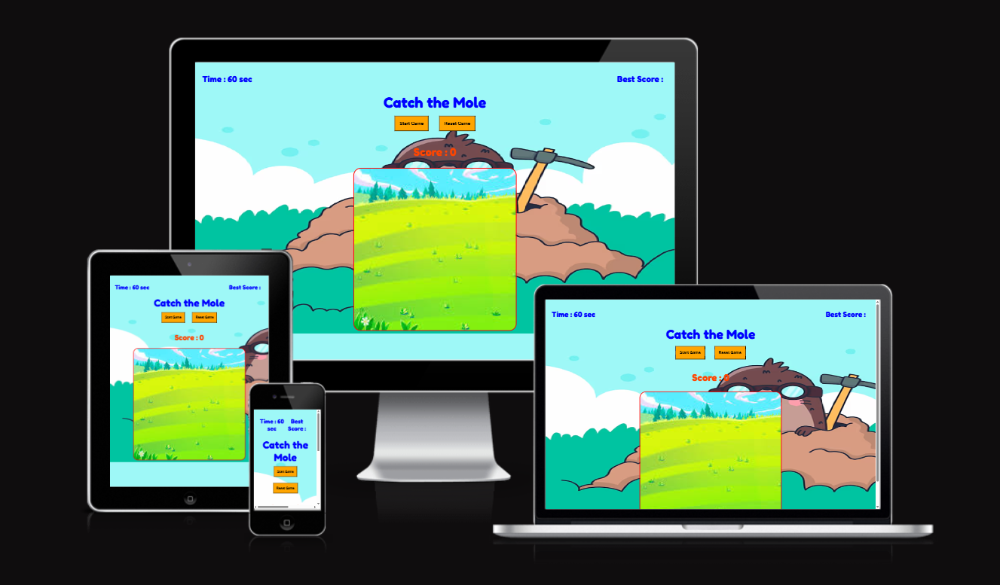

<h1 align="center">CATCH THE MOLE </h1>

[View the game here](https://jyotihambir-bc.github.io/mole-game/)

## Purpose of the Game and Targeted Audience
"Catch the Mole" is a fun and interactive reaction-based game designed to test the player's speed and accuracy. The goal is to score as many points as possible by clicking on moles while avoiding the foxes, which end the game. It helps improve hand-eye coordination, reflexes, and focus through simple yet engaging gameplay.

* 🎯 Target Audience - This game is suitable for:
- Children looking for a fun and easy game to play.
- Casual gamers of all ages seeking a quick and entertaining challenge.
- People interested in improving their reaction time.
- Beginners learning front-end development, as the project demonstrates core web technologies like HTML, CSS, and JavaScript in action.

## User Experience (UX)
### Use Stories
* As a game player I am able to click on start or reset the button so that I can start playing or reset the game again.
* As a game player I can see the time remaining for the game as well as my current score on the screen so that I can enjoy the game.
* As a game player I can able to see my previous best score on the top of the screen so that I know what was my last best score which I have to beat again.
* As a game player whenever I click on mole my score should be increase so that I can know my total score after my game finish.
* As a game player if I click on fox my game should be over with a message about wrongly clicked.
 
  
## Technology Used

### Language Used
* [HTML 5](https://en.wikipedia.org/wiki/HTML/)- Used to structure all the templates on the site
* [CSS 3](https://en.wikipedia.org/wiki/CSS)- to provide extra styling to the site
* [JavaScript](https://www.javascript.com/)- Minimum javascript was used to generate the message pop-up after user submit the booking form.

### Frameworks, Libraries
* [Google Fonts:](https://fonts.google.com/) used for the Fredoka font

## Testing

### Test Cases and Results
  - Testing has taken place continuously throughout the development of the project. Each view was tested regularly.

## Deployment

### How this site was deployed

  - In the GitHub repository, navigate to the Settings tab, then choose Pages from the left hand menu 
  - From the source section drop-down menu, select the Main Branch
  - Once the main branch has been selected, the page will be automatically refreshed with a detailed  ribbon display to indicate the successful deployment
  - Any changes pushed to the main branch will take effect on the live project.

### Acknowledgments
I would like to acknowledge the following resources and technologies that helped in building this project:

- HTML, CSS, JavaScript – Core technologies used for development..
- Google Fonts – For typography.
- ChatGPT – For debugging assistance and development guidance.
- Special thanks to my friends and family for their support and feedback during development.
 

  